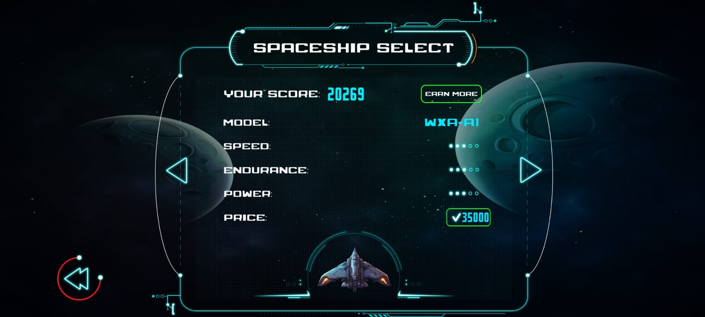
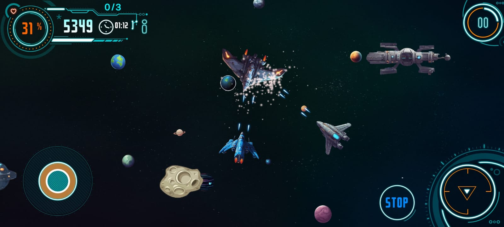
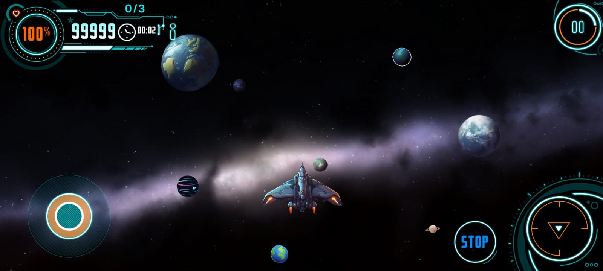
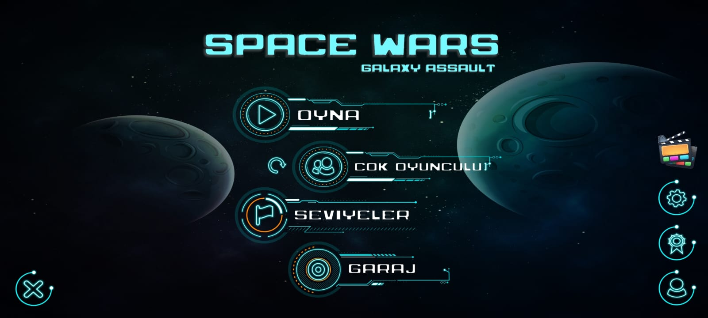
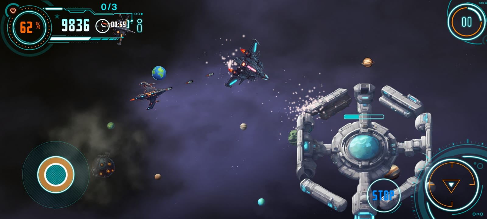
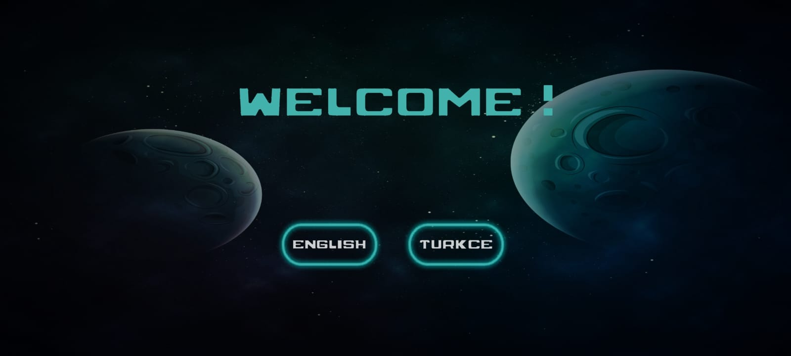
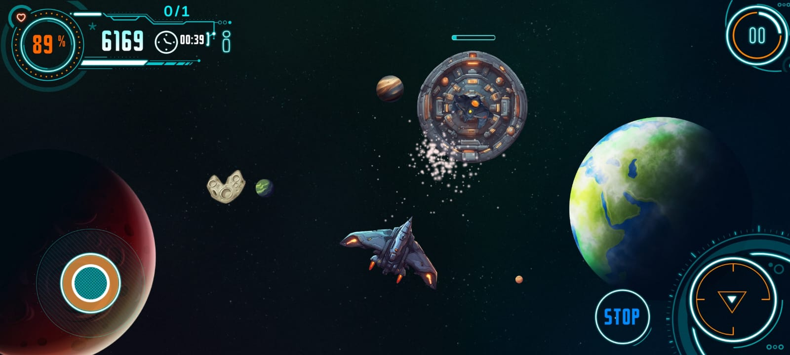

# SPACE WARS 🚀

Bu proje, Unity kullanılarak geliştirilmiş bir 2D uzay savaşı temalı oyundur. Oyunda, oyuncular düşman gemilerine karşı mücadele ederek puan toplamaya çalışır.Oyun hem online hem de offline oynanabilir!

## 🎮 Özellikler
  
  **Online Ve Offline Oyun Modu:** Tek başınıza oynayabilir veya diğer oyunculara karşı mücadele edebilirsiniz. 
  **Dinamik Oyun Mekanikleri:** Oyuncu gemisi hareket eder, ateş eder ve düşmanlara karşı savunma yapar. 
  **Yükselen Zorluk Seviyesi:** Oyunda ilerledikçe düşman sayısı ve zorluğu artar. 
  **Puanlama Sistemi:** Her yok edilen düşman gemisi için puan kazanılır.

## 💻 Kullanılan Teknolojiler

  **Unity:** Oyun motoru. 
  **C#:** Oyun kodlaması için kullanılan ana programlama dili. 
  **Firebase:** Kullanıcı verilerini yönetmek için. 
  **Photon PUN:**  Online oyun modunda gerçek zamanlı eşleştirme ve çok oyunculu desteği.
  
  
## Ekran Görüntüleri

&nbsp;

&nbsp;

&nbsp;

&nbsp;

&nbsp;

&nbsp;

&nbsp;

&nbsp;
